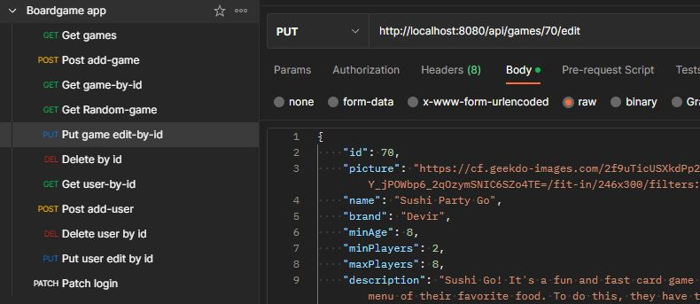
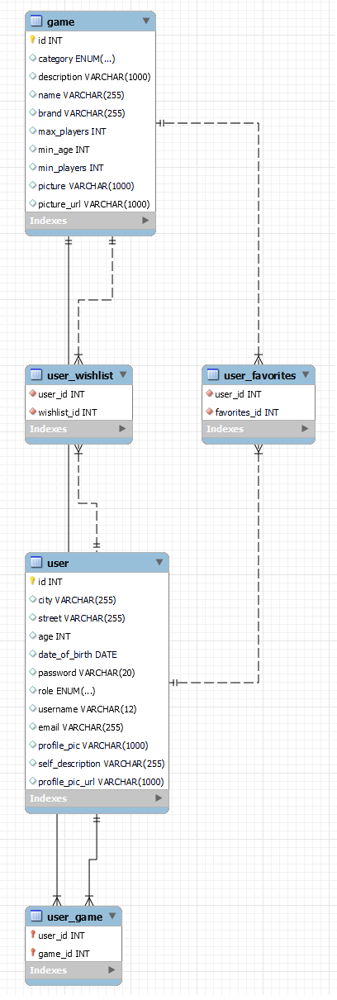

# server-boardgamer

## ROUTING AND ENDPOINTS
## API Endpoints (backend routes)
CRUD OF USER ROUTES: 
| HTTP Method | URL                                   | Request Body                 | Success status | Error Status | Description                                                  |
| ----------- | ---------------------------           | ---------------------------- | -------------- | ------------ | ------------------------------------------------------------ |
| GET         | `/api/user/{id}    `                |                | 200            | 404          | Shows specific users information           |
| PUT         | `/api/user/{id}/edit`             |  {username, email, selfDescription, profilePic, role}     |         200    | 401          | Updates user's information |
| POST         | `/api/user/add-user`             |      | 200            | 400          | Creates user | 
| POST         | `/api/user/add-game/{userId}/{gameId}`             |       |             | 400          | Adds specific game to a collection of user|
| POST         | `/api/user/add-wishlist/{userId}/{gameId}`             |       |             | 400          | Adds specific game to a collection of user |
| POST         | `/api/user/add-favourite/{userId}/{gameId}`             |       |             | 400          | Adds specific game to a collection of user |
| PATCH         | `/api/user/login`             | {LoginDTO: username, password}      |            200 | 404          | Allows user to login without severe Authentication |
| DELETE         | `/api/user/{id}/delete`                 |          | 200            |   401       | Deletes user   |

CRUD OF GAME ROUTES:
| HTTP Method | URL                                   | Request Body                 | Success status | Error Status | Description                                                  |
| ----------- | ---------------------------           | ---------------------------- | -------------- | ------------ | ------------------------------------------------------------ |
| GET         | `/api/user/    `                |                | 200            | 404          | Shows list of all games           |
| GET         | `/api/games/{id}    `                |                | 200            | 404          | Shows specific game information           |
| GET         | `/api/games/random-game    `                |                | 200            | 404          | Shows random game information           |
| PUT         | `/api/games/{id}/edit`             |  {name, brand, description, picture, minAge, maxPlayers, minPlayers}     |         200    | 401          | Updates games's information |
| POST         | `/api/games/add-games`             |      | 200            | 400          | Creates game |
| DELETE         | `/api/games/{id}/delete`                 |          | 200            |   401       | Deletes game   |

#### Testing routes in postman

#### Class Diagram downloaded from MySQL Workbench

### TESTS:
There are two types of tests:
- ControllerTest with `MockMvc`
- RepositoryTest with `JUnit`